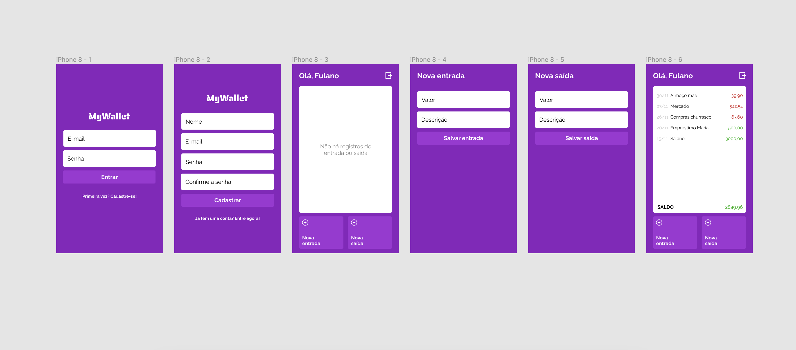

# My Wallet - Simplified Financial Management 💰


## Overview

The "My Wallet" project was developed as part of my journey to enhance my full-stack development skills. It is an interactive web application that provides users with a way to manage their personal finances.

## Usage Instructions

Interested in checking out the project? No problem! It's available through  the deployment [link.](https://my-wallet-react-two.vercel.app/).

However, please note that the backend is hosted on Render. In situations where the server has been inactive for a few days, there may be a slight delay in the initial response. Once it gets going the first time, it flows smoothly, haha.

## Installation

```bash
$ npm install
```

## Key Features

- **Secure Registration and Authentication:** Through React.js and JWT tokens, I've created registration and login pages that offer a secure and efficient entry for users.


- **Smart Expense Management:** The homepage allows dynamic addition of expenses. The standout feature is the automatic expense calculation, providing a good view of spending in relation to income.
- **Quality Responsive Experience:** While the concept is geared towards mobile experience, the project offers a great experience even when accessed via web technologies.

## Technologies at a Glance

- **Notable Front-End:** I used React.js to create interactive and visually appealing interfaces, prioritizing usability.

- **Robust Back-End Infrastructure:** Behind the scenes, I used Express.js and Node.js to build a secure and well-structured environment. User information storage and management were done through MongoDB.

## Challenges and Strategic Solutions

One challenge I faced was how to handle user information after logout, ensuring security and continuity of the user's transaction history. In this regard, the combination of Local Storage with a context was the solution I chose to store and retrieve the user token, allowing smooth and secure access without worrying about losing their information even after logout.

## Elegant Design
The project's styling was developed using React and Styled Components. The result is an interface that seamlessly combines functionality and aesthetics.    

## Final Thoughts

The "My Wallet" project combines dedication, practical application, and overcoming some challenges. I believe the experience provided to users was positive, and I was able to establish solid authentication, demonstrating a commitment to data security. This initiative represents a milestone in my learning journey and my career in the world of full-stack development. 🌟🚀